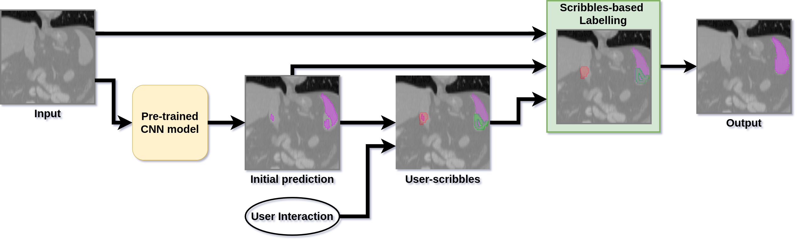
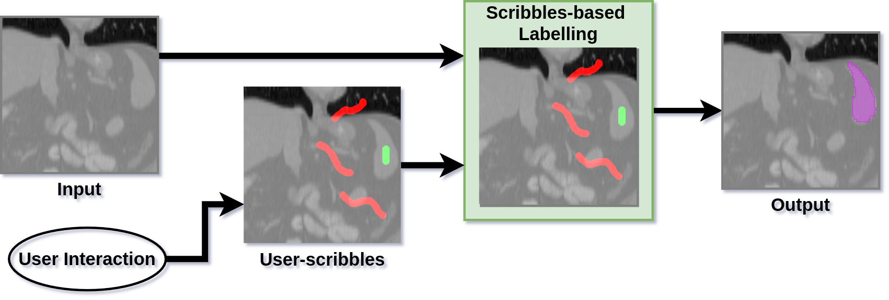

Scribbles are free-hand drawings, such as drawing with a pen on paper, which have been widely employed to propose a range of interactive segmentation methods [[1](https://arxiv.org/pdf/1710.04043.pdf), [2](https://cs.uwaterloo.ca/~yboykov/Papers/pami04.pdf), [3](https://cvg.ethz.ch/teaching/cvl/2012/grabcut-siggraph04.pdf)]. Scribbles provide natural interaction, which most annotators are already familiar with. These interactions introduce flexibility in annotators' workload, i.e. it can be as involved as required; providing both minimal interactions for simpler delineation tasks and detailed interactions for more difficult segmentations. 

MONAILabel provides APIs for implementing scribbles-based interactive segmentation workflows. An overview of such workflows is presented in Fig. 1 below. 

    
    Fig. 1. A scribbles-based interactive segmentation workflow.

 
 

In the figure, optional inputs are connected with dotted lines. As can be seen, a scribbles-based interactive segmentation workflow can work in two modes,

1. **Scribbles-only**: uses scribbles to generate segmentation labels
2. **Scribbles-based label refinement**: refines segmentations from a deep learning model using user-scribbles.  

MONAILabel provides sample applications for both 1. and 2.

## Scribbles-only

    
     
    Fig. 2. Scribbles-only flow for labelling data.

 
 

Fig. 2. shows the general workflow for these methods. A scribbles-only approach relies on an annotator to provide scribbles to indicate regions belonging to both foreground and background objects. These scribbles are used to build an *on-the-fly* likelihood model that enables delineation of foreground objects [[4](https://www.microsoft.com/en-us/research/wp-content/uploads/2016/02/Criminisi_eccv2008.pdf)]. An energy optimisation technique then refines these likelihood-based segmentations [[2](https://cs.uwaterloo.ca/~yboykov/Papers/pami04.pdf), [3](https://cvg.ethz.ch/teaching/cvl/2012/grabcut-siggraph04.pdf)]. The process can be repeated to provide additional user-scribbles to further refine the initial segmentations after which the label is saved into a dataset. 

One additional approach (shown in Fig. 3) to improve interaction in such workflows is to use a bounding box for selecting region of interest [[1](https://arxiv.org/pdf/1710.04043.pdf)], where anything outside the bounding box is selected as background scribbles. MONAILabel also provides this functionality by using ROI selection tool.

    
     
    Fig. 3. Bounding box based background scribble application.

 

By using scribbles as interactions in a likelihood-based approach, this method provides a balance between fully-automatic and fully-manual segmentation methods. It is suitable for scenarios where a pre-trained deep learning model is not available, e.g. in cold start situations, as well as when starting to label a new dataset. 

    
     
    Fig. 4. Scribbles-based labelling method currently implemented in all sample apps.

 

 

> Tip: All current MONAILabel sample apps include one implementation of this mode called `Histogram+GraphCut`, which is based on methods from [[2](https://cs.uwaterloo.ca/~yboykov/Papers/pami04.pdf) and [[4](https://www.microsoft.com/en-us/research/wp-content/uploads/2016/02/Criminisi_eccv2008.pdf)]. The flow for this approach is shown in Fig. 4. You may find this [short demo for MONAILabel-based scribbles-only flow](https://www.youtube.com/watch?v=yhC27V3PvIQ) helpful in understanding its usage.

 

## Scribbles-based Label Refinement
The workflow for this approach uses all connections in Fig. 1. It relies on a pre-trained deep learning model to provide initial segmentations which are shown to an annotator who provides scribbles in places where corrections are required. The original input volume, deep learning model's output and user-scribbles are then used in scribbles-based label refinement stage which applies the correction using an energy optimisation technique (as shown in Fig. 5). The process can be repeated to provide additional user-scribbles to further refine the initial segmentations after which the label is saved into a dataset.

    
     
    Fig. 5. Scribbles-based label refinement approach used for refining initial segmentation labels from a deep learning model.

 

 

> Tip: The MONAILabel sample apps zoo at [https://github.com/diazandr3s/MONAILabel-Apps](https://github.com/diazandr3s/MONAILabel-Apps) provides [an implementation of scribbles-based label refinement approach](https://github.com/diazandr3s/MONAILabel-Apps/tree/AppsV02/segmentation_spleen_scribbles) from [[1](https://arxiv.org/pdf/1710.04043.pdf)] as an example to demonstrate the use-case for such approaches.

 

---
[[1] Wang, Guotai, et al. "Interactive medical image segmentation using deep learning with image-specific fine tuning." IEEE transactions on medical imaging 37.7 (2018): 1562-1573.](https://arxiv.org/pdf/1710.04043.pdf)

[[2] Boykov, Yuri, and Vladimir Kolmogorov. "An experimental comparison of min-cut/max-flow algorithms for energy minimization in vision." IEEE transactions on pattern analysis and machine intelligence 26.9 (2004): 1124-1137.](https://cs.uwaterloo.ca/~yboykov/Papers/pami04.pdf)

[[3] Rother, Carsten, Vladimir Kolmogorov, and Andrew Blake. "" GrabCut" interactive foreground extraction using iterated graph cuts." ACM transactions on graphics (TOG) 23.3 (2004): 309-314.](https://cvg.ethz.ch/teaching/cvl/2012/grabcut-siggraph04.pdf)

[[4] Criminisi, Antonio, Toby Sharp, and Andrew Blake. "Geos: Geodesic image segmentation." European Conference on Computer Vision. Springer, Berlin, Heidelberg, 2008.](https://www.microsoft.com/en-us/research/wp-content/uploads/2016/02/Criminisi_eccv2008.pdf)
